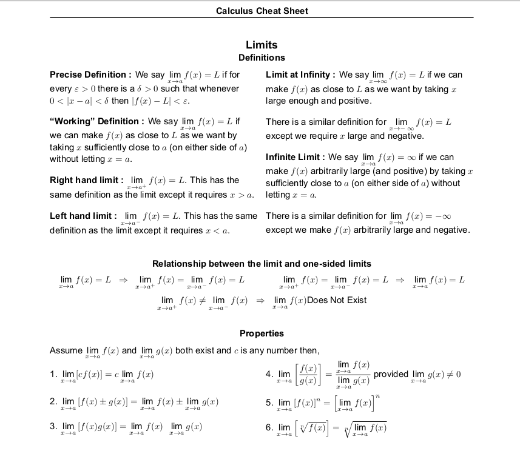

# Calculus-and-Optimization

[Table of Contents](#table-of-contents)  
* [Books](#books)  
* [NPTEL and MOOCs Courses](#course)  
* [Notes](#notes)  
* [Articles](#articles)  
* [Practice Problems](#practice-problems)

### Quick overview

(calculus_cheat_sheet_all.pdf)
[Download Full Pdf](Data/Calculus-and-Optimization/calculus_cheat_sheet_all.pdf)

---

## Books

Explore these recommended books to enhance your understanding of Probability and Statistics:

<!--
- [**"All of Statistics: A Concise Course in Statistical Inference"**](https://egrcc.github.io/docs/math/all-of-statistics.pdf) by  Larry Wasserman 
  A comprehensive resource for statistical theory and its applications.
-->

- [**"Calculus Online Textbook"**](https://ocw.mit.edu/courses/res-18-001-calculus-online-textbook-spring-2005/pages/textbook/) by  Gilbert Strang
- [**"Convex Optimization"**](https://web.stanford.edu/~boyd/cvxbook/) by Stephen Boyd and Lieven Vandenberghe
  
---

## NPTEL and MOOCs Courses

Course to deepen your knowledge of Probability and Statistics:

---

## Notes

Review these comprehensive notes to reinforce your grasp of Probability and Statistics:

- [**"Harvard Calculus Course Notes "**](https://people.math.harvard.edu/~knill/teaching/math1a_2012/handouts.html)  As suggested by Arjun Suresh (Gate Overflow): Sufficient for GATE
- [**"Optimization Notes COL774 IIT DELHI"**](https://www.cse.iitd.ac.in/~parags/teaching/col774/review/convex-1.pdf) By Prof. Parag Singla IIT DELHI - COL774 Course

---

## Articles

Read insightful articles on Probability and Statistics to gain additional insights:

---

## Practice Problems

Test your knowledge and skills with these practice problems:

---

#### Table of Contents

* [Books](#books)  
* [NPTEL and MOOCs Courses](#course)  
* [Notes](#notes)  
* [Articles](#articles)  
* [Practice Problems](#practice-problems)

